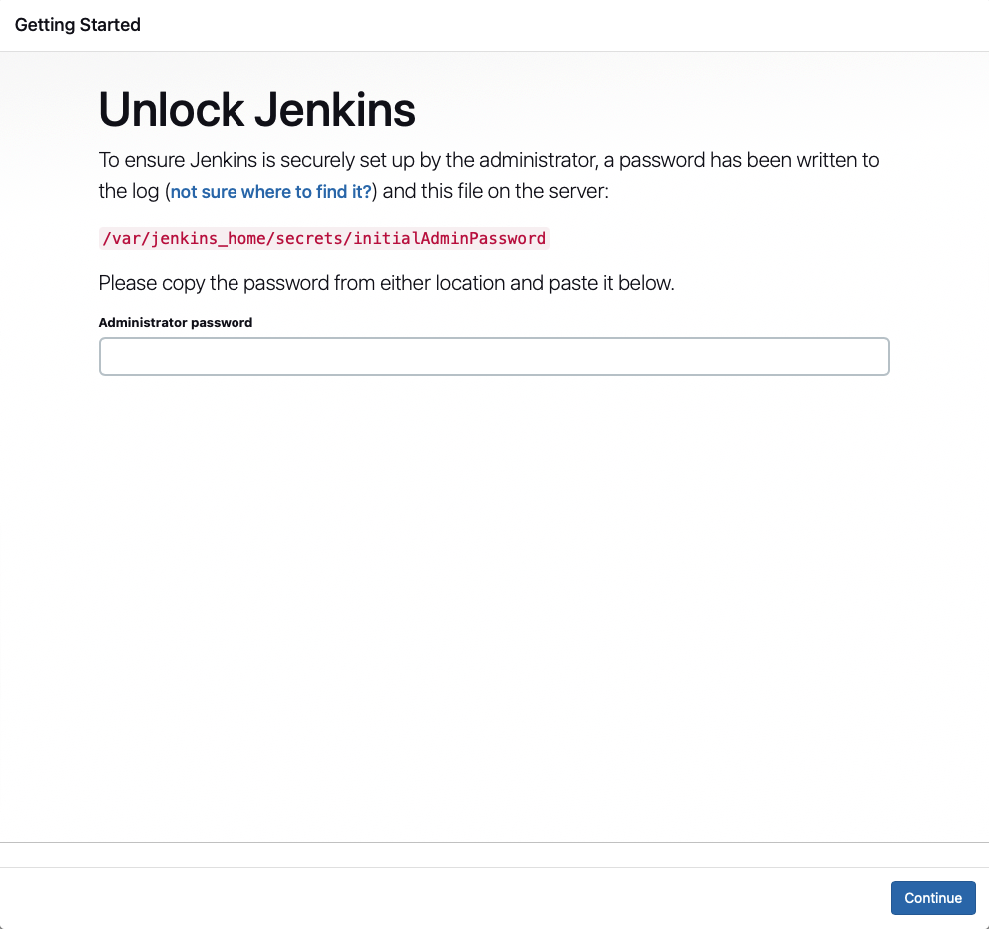
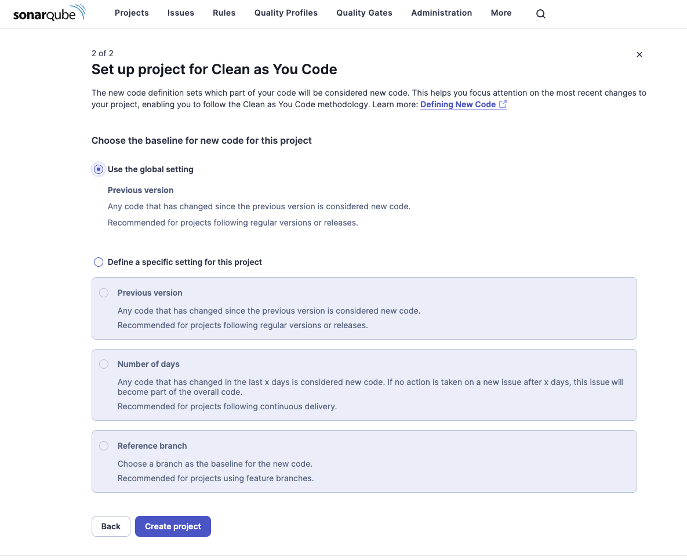

# Sonarqube smanetting

A docker-compose file to run a Sonarqube server with a Postgres database.

This docker-compose include an instance of Jenkins to run the Sonarqube scanner.

## Table of Contents

- [Prerequisites](#prerequisites)
- [Usage](#usage)
- [Links](#links)
- [Default credentials](#default-credentials)
- [First Configuration](#first-configuration)
  - [Sonarqube](#sonarqube)
  - [Jenkins](#jenkins)
  - [Jenkins Sonarqube Scanner Plugin](#jenkins-sonarqube-scanner-plugin)


## Prerequisites

- [Docker](https://www.docker.com/)
- [Docker Compose](https://docs.docker.com/compose/)

## Usage

```bash
docker-compose up -d
```

## Links

- Sonarqube: [http://localhost:9000](http://localhost:9000)
- Jenkins: [http://localhost:8080](http://localhost:8080)

## Default credentials

- Sonarqube: admin/admin
- Jenkins: admin/password

## First Configuration

### Sonarqube

First configuration:

* Login with the default credentials


* Change the default password


Now Sonarqube is ready to use.


### Jenkins

First configuration:

* Unlock Jenkins



Show in the log the initial password:

```bash
docker logs jenkins | less
```

Look for the line:

```bash
*************************************************************
*************************************************************
*************************************************************
 
Jenkins initial setup is required. An admin user has been created and a password generated.
Please use the following password to proceed to installation:
 
c061b679107a4893b5383617729b5c6a
 
This may also be found at: /var/jenkins_home/secrets/initialAdminPassword
 
*************************************************************
*************************************************************
************************************************************* 
```

Enter the password and click Continue

Select Install Suggested Plugins on the next page. When Jenkins finishes, it will prompt you for a new admin user and password. Enter a user name and password and click Save and Continue


The next page gives you a chance to change the host name of your controller. For this tutorial, you can accept the default and click Save and Finish.


Now Jenkins is ready to use. Click Start using Jenkins.


[Reference](https://www.cloudbees.com/blog/how-to-install-and-run-jenkins-with-docker-compose)

### Jenkins Sonarqube Scanner Plugin

You need to install the Sonarqube Scanner plugin in Jenkins.

- [Using the GUI](https://www.jenkins.io/doc/book/managing/plugins/#from-the-web-ui): From your Jenkins dashboard navigate to Manage Jenkins > Manage Plugins and select the Available tab. Locate this plugin by searching for sonar.
- Using the [CLI tool](https://plugins.jenkins.io/sonar/#releases):
    - jenkins-plugin-cli --plugins sonar:2.17.2
- [Using direct upload](https://www.jenkins.io/doc/book/managing/plugins/#advanced-installation). Download one of the [releases](https://plugins.jenkins.io/sonar/#releases) and upload it to your Jenkins instance.

[Reference](https://plugins.jenkins.io/sonar/)

## Configuration

### Sonarqube GitHub

**Step 1:** Create a Github App

- Go to [Github Developer Settings](https://github.com/settings/apps)
- Click on New Github App
- Fill the form
    - GitHub App name: `<name>`
    - Homepage URL: `https://www.sonarqube.org/`
    - Callback URL: `http://localhost:9000`
    - Create a new client secret
    - Create a new private key
    - Permissions
        
| Type                      | Permission        | Access        |
|---------------------------|-------------------|---------------|
| Repository permissions    | Checks            | Read & write  |
| Repository permissions    | Contents          | Read          |
| Repository permissions    | Metadata          | Read          |
| Repository permissions    | Pull requests     | Read & write  |
| Organization permissions  | Members           | Read          |
| Organization permissions  | Projects          | Read          |
| Account permissions       | Email addresses   | Read          |

**Step 2:** Configure the Github App in Sonarqube


- Go to [DevOps Platform Integrations](http://localhost:9000/admin/settings?category=almintegration)
- Click on Create configuration
- Fill the form
    - Configuration name: `<name>`
    - GitHub API URL: `https://api.github.com` (if use GitHub Enterprise, change the URL in `https://github.company.com/api/v3`)
    - GitHub App ID: `<app_id>`
    - Client ID: `<client_id created at the Step 1>`
    - Client Secret: `<client_secret created at the Step 1>`
    - Private Key: `<private_key generated at the Step 1>` (.pem)
- By clicking on Ckeck configuration, it will be possible to check whether the configuration is correct:


**Step 3**: Configure the SonarQube Scanner in Jenkins

- Install the SonarQube Scanner plugin in Jenkins


***Create a Pipeline Job***


1. From Jenkins' dashboard, click New Item and create a Pipeline Job.
2. Under Build Triggers, choose Trigger builds remotely. You must set a unique, secret token for this field.
3. Under Pipeline, make sure the parameters are set as follows:
    - Definition: Pipeline script from SCM
    - SCM: Configure your SCM. Make sure to only build your main branch. For example, if your main branch is called "main", put "*/main" under Branches to build.
    - Script Path: Jenkinsfile
4. Click Save.


***Create a Github Webhook***

Create a Webhook in your repository to trigger the Jenkins job on push. You may skip this step if you already have a Webhook configured.

1. Go to the GitHub Webhook creation page for your repository and enter the following information:
URL: Enter the following URL, replacing the values between *** as needed:

```
***JENKINS_SERVER_URL***/job/***JENKINS_JOB_NAME***/build?token=***JENKINS_BUILD_TRIGGER_TOKEN***
```

2. Under Which events would you like to trigger this webhook? select Let me select individual events and check the following:
* Pushes

3. Click Add webhook.


TODO


**Step 4**: Configure the Project in Sonarqube

Go to [Sonarqube Projects](http://localhost:9000/projects)

Import from Github:


If the configuration is correct, the project will be imported:

Select the organization connected to the Github App and the repository:


Then press the 'Import' button to import the project.



Click the button "Create Project" to finish the configuration.

